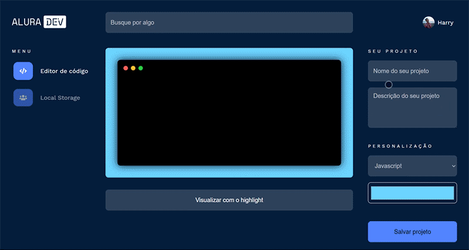

# AluraDev - Alura Challenge 🔥
O alura Challenge foi um evento de programação Front-End de 3 semanas para desenvolver uma aplicação web a partir de layouts disponibilizados na plataforma Figma e sprints no Trello.
  
O site criado consiste em um editor de texto capaz de aplicar syntax highlighting e armazenar trechos de código em localStorage. Para acessá-lo, <a href="https://raphael-ramalho.github.io/AluraDev/">clique aqui<a/>.

  

  
<h3>📗 Principais conceitos colocados em prática:</h3>
  <ul>
    <li>Flexbox
    <li>CSS Grid
    <li>Media query
    <li>DOM
  </ul>

<h3>💻 Tecnologias utilizadas:</h3>
  <ul>
    <li>HTML5
    <li>CSS3
    <li>Javascript
    <li>Visual Studio Code
  </ul>
